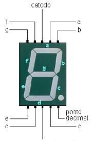
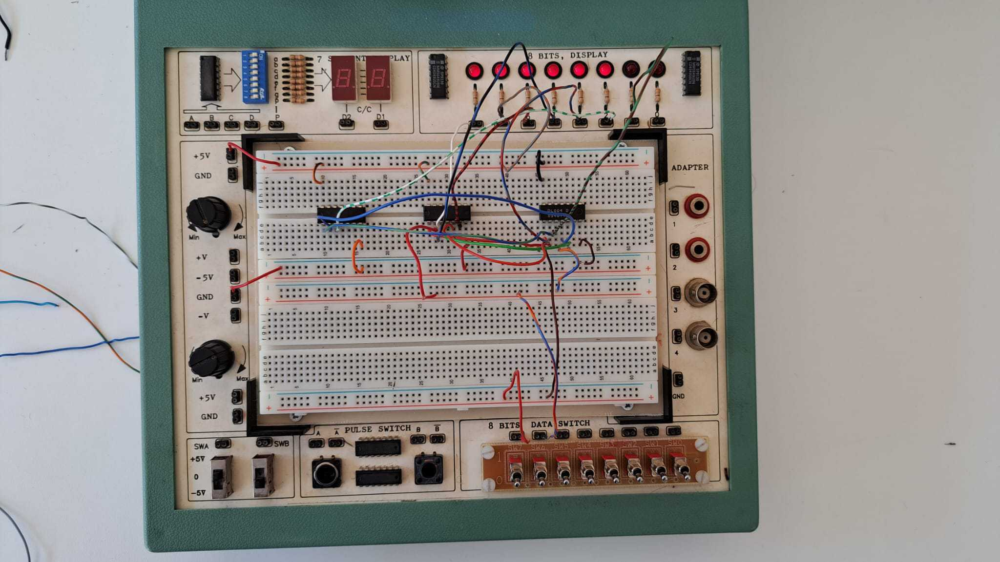

# 2º Trabalho de Laboratório - Implementação de circuito descodificador de binário para 7 segmentos

Pretende-se com este trabalho de laboratório introduzir e familiarizar os alunos com as
ferramentas de desenvolvimento de circuitos e com um conjunto de conceitos de base para a
Unidade Curricular de Electrónica Digital. O trabalho será realizado ao longo de duas aulas.

Neste trabalho são implementados circuitos no simulador Logisim para um descodificador de
binário para 7 segmentos e um conjunto de circuitos comparadores. O circuito realizado em
hardware é implementado numa placa Basys 2 da Digilent, programada para realizar a
descodificação de binário para 7 segmentos e receber dois números para comparação.

Ao longo das duas aulas serão, portanto, lecionadas um conjunto de ferramentas de auxílio ao
teste e verificação de circuitos digitais.

## Resultado Prático

## Dá jeito

Logisim tutorial:
http://baillifard.com/logisim/en/html/guide/

Display de 7 segmentos
https://www.electronicshub.org/7-segment-display-pinout/