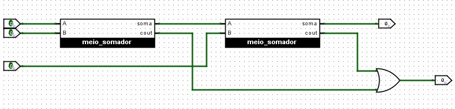
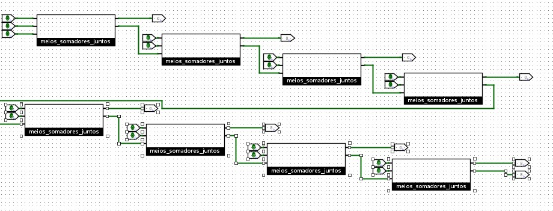
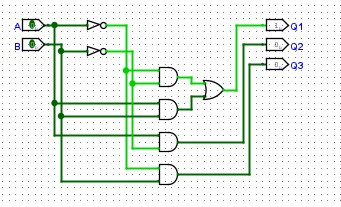
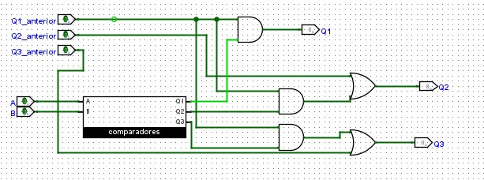
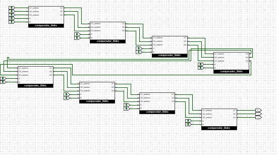

# 3º Trabalho de Laboratório - Circuitos combinatórios, circuitos somadores e comparadores lógicos e de magnitude

As operações de soma são largamente utilizadas nos sistemas digitais modernos. De igual modo os
circuitos comparadores são usados frequentemente na operação por exemplo dos programas de
computadores. Por exemplo as operações que ocorrem numa instrução if () da programação em
linguagem C são executadas por um comparador, de igual modo a instrução i++ utiliza somadores.

Este trabalho explora a implementação e montagem destes dois circuitos.

## Somador completo de 1 bit através de 2 meio-somadores. 

## Somador de números de 8 bits 

---
## Comparador de 1 bit 

## Comparador de números de 8 bits

## Comparador de números N bits em cascata
