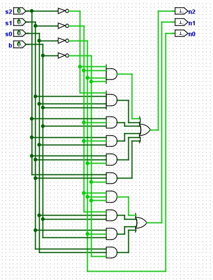
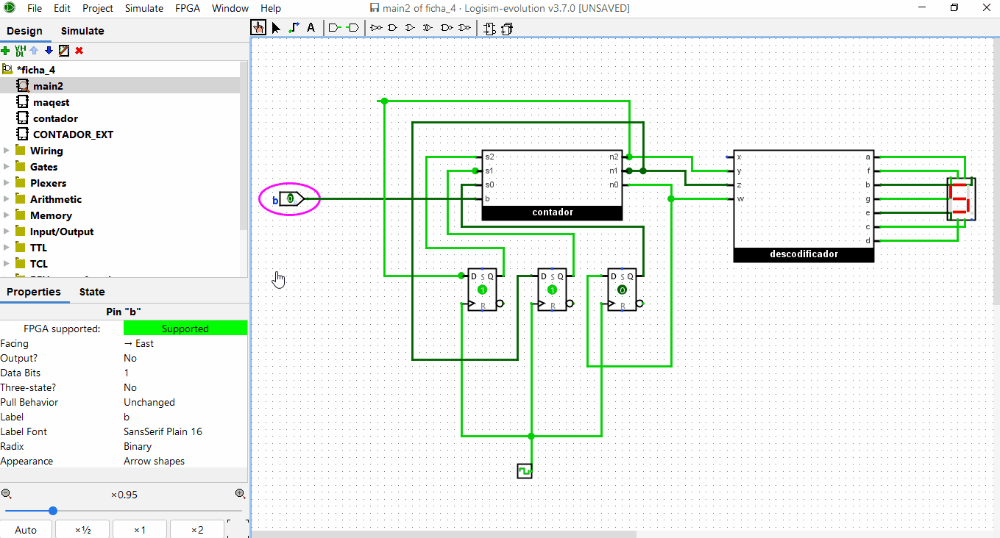
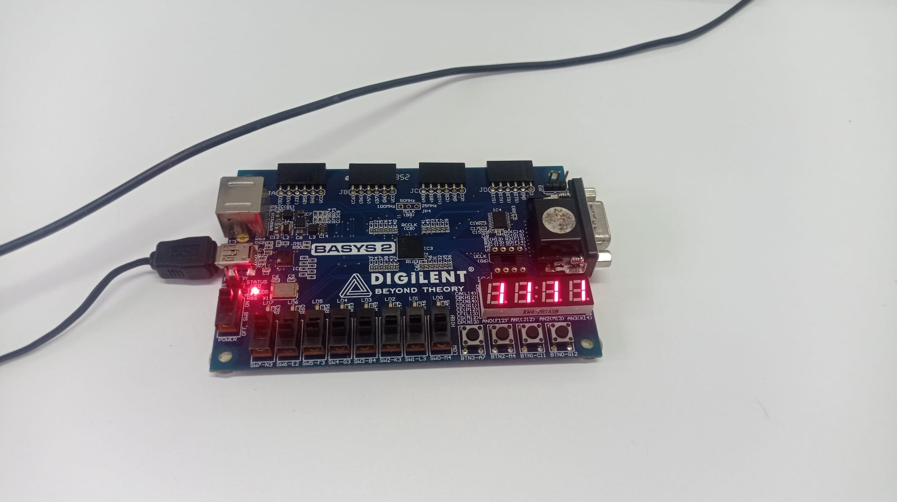

# 4º Trabalho de Laboratório - Implementação de circuitos contadores / Máquinas de estado finitas

Pretende-se com este trabalho de laboratório fomentar a compreensão dos alunos sobre
circuitos contadores, associando-o às máquinas de estado finitas. 

O conceito das máquinas de estado é utilizado para implementar e controlar máquinas sequenciais, ou seja, máquinas cuja
operação num determinado instante dependa do atual estado dos sensores, mas também da sua
sequencia anterior de funcionamento.

Neste trabalho é implementado um contador usando uma máquina de estados. O objetivo do
trabalho é o de implementar o sistema proposto em Logisim e na placa Basys 2 da Digilent. 

## Contador bidirecional usando máquinas de estado



### Tabela de Verdade

```
 s2,s1, s0 e b são inputs - n2, n1, n0 são outputs
```


| s2 | s1 | s0 | b | n2 | n1 | n0 |
|:---|:---|:---|:---|---:|---:|---:|
| 0 | 0 | 0 | 0 | 1 | 1 | 1 |
| 0 | 0 | 0 | 1 | 0 | 0 | 1 |
| 0 | 0 | 1 | 0 | 0 | 0 | 0 |
| 0 | 0 | 1 | 1 | 0 | 1 | 0 |
| 0 | 1 | 0 | 0 | 0 | 0 | 1 |
| 0 | 1 | 0 | 1 | 0 | 1 | 1 |
| 0 | 1 | 1 | 0 | 0 | 1 | 0 |
| 0 | 1 | 1 | 1 | 1 | 0 | 0 |
| 1 | 0 | 0 | 0 | 0 | 1 | 1 |
| 1 | 0 | 0 | 1 | 1 | 0 | 1 |
| 1 | 0 | 1 | 0 | 1 | 0 | 0 |
| 1 | 0 | 1 | 1 | 1 | 1 | 0 |
| 1 | 1 | 0 | 0 | 1 | 0 | 1 |
| 1 | 1 | 0 | 1 | 1 | 1 | 1 |
| 1 | 1 | 1 | 0 | 1 | 1 | 0 |
| 1 | 1 | 1 | 1 | 0 | 0 | 0 |

# Resultado

## Funcionamento no Logisim


## Implementação na Placa
